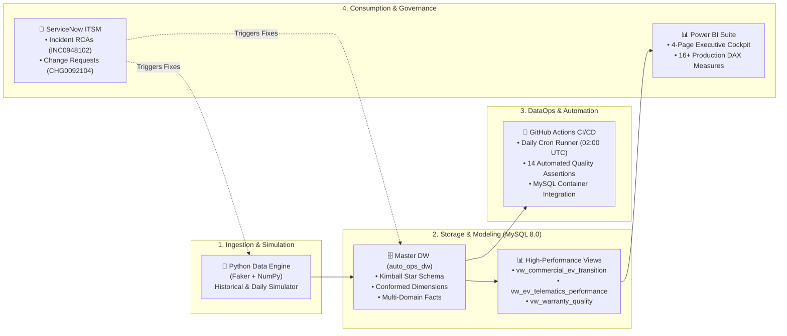

# 🚗 AutoOps 360: Global Connected Automotive & Commercial Intelligence Platform

[](https://github.com/TejalGB/automotive-operations-intelligence/actions)
[](https://www.mysql.com/)
[](https://powerbi.microsoft.com/)
[](https://www.python.org/)
[](https://www.servicenow.com/)

> **Enterprise Data Analytics & Operations Portfolio**  
> **Client Profile:** Global Premium Nordic Automotive OEM (*Anonymized Enterprise Production Case Study*)  
> **Author / Role:** Lead Data Analyst / Analytics Engineer – Commercial & Connected Operations

---

## 📌 Executive Summary

As a premier Nordic automotive manufacturer transitions its fleet to **100% Electrification (EV)**, leadership requires cross-domain intelligence connecting **commercial sales**, **real-world connected vehicle telematics**, and **aftersales quality engineering**.

**AutoOps 360** is an enterprise data analytics platform that unifies the complete automotive lifecycle:
1. 💰 **Commercial & Omnichannel Sales:** Tracking EV transition mix, gross margins, direct-to-consumer (D2C) studio growth, and regional dealer discount leakage.
2. ⚡ **Connected EV Telematics:** Monitoring real-world battery kinetics, DC fast-charging throughput, and cold-weather (Subarctic) range degradation.
3. 🔧 **Aftersales & Warranty Quality:** Delivering early-warning defect detection (Claims per Thousand Vehicles - CPTV at 6 Months in Service) to prevent mass recall liabilities.
4. 🚨 **ITSM & Change Governance:** Fully governed via **ServiceNow** Incident Root Cause Analyses (RCAs) and Change Requests (CHGs) tied directly to GitHub CI/CD automation.

---

## 🏗️ End-to-End Enterprise Architecture



---

## 🗃️ Kimball Star Schema Data Model

```
                                  ┌────────────────────────┐
                                  │       dim_dates        │
                                  │   (Calendar & Fiscal)  │
                                  └───────────┬────────────┘
                                              │
         ┌────────────────────────────────────┼────────────────────────────────────┐
         │                                    │                                    │
         ▼                                    ▼                                    ▼
┌─────────────────────────┐      ┌─────────────────────────┐      ┌─────────────────────────┐
│   fct_vehicle_sales     │      │ fct_charging_telematics │      │   fct_warranty_claims   │
│ • Delivery Lead Days    │      │ • Ambient Temp (°C)     │      │ • Months in Service     │
│ • Net Revenue (EUR)     │      │ • Avg Speed (kW)        │      │ • Defect Category       │
│ • Gross Margin %        │      │ • Start/End SoC %       │      │ • Total Claim Cost      │
│ • Discount Leakage %    │      │ • Battery Delta Temp    │      │ • Safety Critical Flag  │
└────────────┬────────────┘      └────────────┬────────────┘      └────────────┬────────────┘
             │                                │                                │
             ├────────────────────────────────┼────────────────────────────────┤
             ▼                                ▼                                ▼
┌─────────────────────────┐      ┌─────────────────────────┐      ┌─────────────────────────┐
│      dim_vehicles       │      │      dim_geography      │      │       dim_dealers       │
│ • Model (EX30, EX90...) │      │ • Sales Region          │      │ • Retailer Name         │
│ • Battery Specs (kWh)   │      │ • Climate Zone          │      │ • Channel (D2C/Dealer)  │
│ • Software Release      │      │ • Currency & Subsidies  │      │ • EV Certified Flag     │
└─────────────────────────┘      └─────────────────────────┘      └─────────────────────────┘
```

---

## 📂 Repository Directory Structure

```
📁 automotive-operations-intelligence/
│
├── 📂 sql/                               # ⭐ MySQL 8.0 DDL & Analytical Views
│   ├── 01_schema_ddl.sql                 # Table creation (Primary/Foreign Keys, Indexes)
│   ├── 02_analytical_views.sql           # CTEs & Window function views for Power BI
│   └── 03_business_queries.sql           # 10 Enterprise Analytical Business Queries
│
├── 📂 src/                               # ⭐ Python DataOps Engine
│   ├── data_generator.py                 # Master synthetic generator (12k VINs, 10k Sales)
│   ├── db_loader.py                      # MySQL database loader via SQLAlchemy
│   ├── run_daily_pipeline.py             # Incremental day simulator & orchestrator
│   └── data_quality_checks.py            # Automated test suite (14 quality assertions)
│
├── 📂 itsm_governance/                   # ⭐ ServiceNow ITSM Tickets & Operations
│   ├── INC0948102_rca_currency_fx.md     # Incident RCA: UK/US Sales Margin Currency Fix
│   ├── INC0841203_rca_subscription.md    # Incident RCA: Care Subscription Discount Fix
│   ├── CHG0092104_change_request.md      # Change Request: EV Battery Subsidy deployment
│   └── data_operations_sop.md            # Standard Operating Procedure for Pipeline Triage
│
├── 📂 bi/                                # ⭐ Power BI Specifications & DAX
│   ├── dax_measures_dictionary.md        # 16+ Production DAX formulas & business logic
│   └── powerbi_setup_guide.md            # Step-by-step visual dashboard layout guide
│
├── 📂 data/marts/                        # ⭐ Star Schema Relational CSV Marts (Live Data)
│   ├── dim_dates.csv
│   ├── dim_vehicles.csv
│   ├── dim_dealers.csv
│   ├── dim_geography.csv
│   ├── dim_exchange_rates.csv
│   ├── fct_vehicle_sales.csv
│   ├── fct_charging_telematics.csv
│   └── fct_warranty_claims.csv
│
└── 📂 .github/
    ├── ISSUE_TEMPLATE/servicenow_incident.md # ServiceNow Incident form for GitHub Issues
    └── workflows/daily_pipeline.yml          # GitHub Actions scheduled automation
```

---

## 🛠️ Step-by-Step Setup in VS Code

### 1. Clone & Open in VS Code
```bash
git clone https://github.com/TejalGB/automotive-operations-intelligence.git
cd automotive-operations-intelligence
code .
```

### 2. Install Python Dependencies
```bash
pip install pandas numpy sqlalchemy pymysql
```

### 3. Generate Historical Baseline Data
```bash
python src/data_generator.py --mode baseline
```
*Output: Generates all 7 master Star Schema datasets inside `data/marts/`.*

### 4. Execute Automated Data Quality Tests
```bash
python src/data_quality_checks.py
```
*Output: Runs 14 comprehensive tests across Primary Keys, Foreign Keys, Physical SoC limits, and Financial business rules.*

### 5. Simulate an Incremental Business Day
```bash
python src/run_daily_pipeline.py --days 1
```
*Output: Ingests 30-50 new car deliveries, 200+ charging sessions, and updates the database automatically.*

### 6. (Optional) Load into Local MySQL Database
```bash
# Set your MySQL credentials (if running MySQL locally)
set MYSQL_USER=root
set MYSQL_PASSWORD=your_password
python src/db_loader.py
```

### 7. Connect Power BI Desktop
* Follow the [Power BI Setup Guide](bi/powerbi_setup_guide.md) to connect to MySQL or load the `data/marts/` folder directly.

---

## 📊 Key Executive Metrics & DAX Highlights

| Metric Name | Business Definition | DAX / SQL Formula Summary |
| :--- | :--- | :--- |
| **EV Sales Mix %** | Proportion of deliveries that are pure electric | `COUNTROWS(Pure_EV) / COUNTROWS(All Sales)` |
| **Weighted Gross Margin %** | Realized net margin across global currencies | `SUM(gross_profit_eur) / SUM(net_revenue_eur)` |
| **Discount Leakage %** | MSRP value lost to dealer concessions | `SUM(discounts) / SUM(MSRP) [Excl. Subscriptions]` |
| **Early Life CPTV** | Defect rate per 1,000 vehicles at $\le 6$ MIS | `(Early Claims / Total Deliveries) * 1000` |
| **Cold Degradation Index** | DC Fast-charge speed reduction in $<0^\circ\text{C}$ | `Avg Speed (<0°C) / Avg Speed (>=15°C)` |

---

## 🚨 ServiceNow Incident & Change Governance Case Studies

This repository demonstrates authentic enterprise ITIL/ITSM operational maturity:

* **[INC0948102 - Currency Normalization Hotfix](itsm_governance/INC0948102_rca_currency_fx.md):**  
  * *Problem:* UK and US sales displayed negative margins in Power BI.
  * *Root Cause:* Unconverted GBP/USD figures compared against EUR factory costs.
  * *Resolution:* Added currency exchange layer (`dim_exchange_rates`) and automated financial sanity unit tests in CI.
* **[INC0841203 - Nordic Car Subscription Discount Anomaly](itsm_governance/INC0841203_rca_subscription.md):**  
  * *Problem:* Subscription rollout caused Discount Leakage KPI to jump to $18\%$.
  * *Root Cause:* Subscription upfront sales price is €0 (monthly MRR recognized separately).
  * *Resolution:* Updated DAX filter context to isolate retail dealer discounts from fleet subscriptions.
* **[CHG0092104 - EV Subsidy Tier Deployment](itsm_governance/CHG0092104_change_request.md):**  
  * Standard Change Request with complete test evidence and backout rollback scripts.

---

## 🎙️ Interview Talking Points (STAR Method)

When discussing this project in technical or leadership interviews:

> *"In my role supporting Commercial & Connected Vehicle Operations, I designed and maintained the Star Schema data models connecting our global retail sales with connected EV telematics and aftersales warranty data in MySQL and Power BI.*
> 
> *When our European EV expansion exposed margin discrepancies in the UK, I led the investigation on a P2 ServiceNow incident, identified unnormalized currency joins, deployed an SQL normalization fix, and authored automated CI tests in GitHub Actions to prevent financial regressions.*
> 
> *Our 4-page Power BI executive suite enabled leadership to monitor regional EV transition pace (achieving 48% EV mix in the Nordics) and identify battery fast-charging bottlenecks in sub-zero winter temperatures."*

---

## 📄 License & Attribution
This project is an anonymized industry case study designed for enterprise portfolio demonstration. All vehicle identification numbers (VINs) and customer records are synthetically generated.
