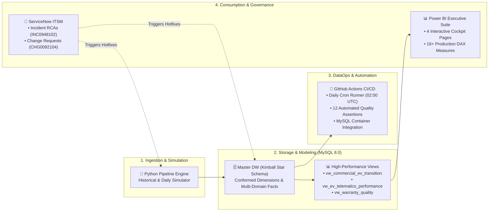

# 🚗 AutoOps 360: Global Connected Automotive & Commercial Intelligence Platform

[](https://github.com/TejalGB/automotive-operations-intelligence/actions)
[](https://www.mysql.com/)
[](https://powerbi.microsoft.com/)
[](https://www.python.org/)
[](https://www.servicenow.com/)

An enterprise-grade automotive data analytics and operations platform connecting **global commercial sales**, **real-world connected EV battery telematics**, and **aftersales warranty engineering** using **Python, MySQL 8.0, and Microsoft Power BI**, with automated **GitHub Actions CI/CD** and **ServiceNow ITSM governance**.

---

## 📌 Executive Summary & Business Objectives

As global automotive manufacturers accelerate the transition toward **100% Electrification (EV)** and omnichannel **Direct-to-Consumer (D2C)** sales, leadership requires unified, cross-functional intelligence. 

This platform delivers an end-to-end analytics framework to:
1. **Track Commercial Sales & EV Mix:** Monitor revenue expansion, powertrain transition pace (BEV/PHEV/MHEV), and gross profit across global markets.
2. **Control Retail Pricing & Discount Leakage:** Evaluate dealer concessions, delivery lead times, and Direct-to-Consumer (D2C) studio performance versus traditional franchised retail.
3. **Analyze Connected EV Telematics & Battery Kinetics:** Assess real-world DC Fast Charging throughput curves, charger protocol adoption, and ambient temperature/winter range degradation.
4. **Early Defect & Warranty Cost Mitigation:** Track Claims per Thousand Vehicles (CPTV) at 6 Months in Service (MIS) and early-warning Pareto defect signatures to prevent widespread recall liabilities.
5. **Enforce Enterprise Data Quality & ITIL Governance:** Ensure 100% data contract integrity through automated CI/CD assertion suites and ServiceNow Incident Root Cause Analyses (RCAs).

---

## 🛠️ Tech Stack & Architecture

- **Data Engineering & Automation:** Python 3.12, Pandas, NumPy, PyMySQL
- **Database & Data Modeling:** MySQL 8.0 (Kimball Dimensional Star Schema, Analytical CTE Views)
- **Business Intelligence & Reporting:** Microsoft Power BI Desktop, DAX (Data Analysis Expressions)
- **CI/CD & Orchestration:** GitHub Actions (Automated daily data generation, 12 data quality assertions, schema testing)
- **Enterprise IT Governance:** ServiceNow ITSM Incident Management & Change Control (RCAs & CHGs)



---

## 🗃️ Dimensional Data Model (Star Schema)

```
                                  ┌────────────────────────┐
                                  │       dim_dates        │
                                  │   (Calendar & Fiscal)  │
                                  └───────────┬────────────┘
                                              │
         ┌────────────────────────────────────┼────────────────────────────────────┐
         │                                    │                                    │
         ▼                                    ▼                                    ▼
┌─────────────────────────┐      ┌─────────────────────────┐      ┌─────────────────────────┐
│   fct_vehicle_sales     │      │ fct_charging_telematics │      │   fct_warranty_claims   │
│ • Delivery Lead Days    │      │ • Ambient Temp (°C)     │      │ • Months in Service     │
│ • Net Revenue (EUR)     │      │ • Avg Speed (kW)        │      │ • Defect Category       │
│ • Gross Margin %        │      │ • Start/End SoC %       │      │ • Total Claim Cost      │
│ • Discount Leakage %    │      │ • Charger Protocol      │      │ • Safety Critical Flag  │
└────────────┬────────────┘      └────────────┬────────────┘      └────────────┬────────────┘
             │                                │                                │
             ├────────────────────────────────┼────────────────────────────────┤
             ▼                                ▼                                ▼
┌─────────────────────────┐      ┌─────────────────────────┐      ┌─────────────────────────┐
│      dim_vehicles       │      │      dim_geography      │      │       dim_dealers       │
│ • Model (EX30, EX90...) │      │ • Sales Region          │      │ • Retailer Name         │
│ • Battery Specs (kWh)   │      │ • Climate Zone          │      │ • Channel (D2C/Dealer)  │
│ • Software Release      │      │ • Currency Exchange     │      │ • EV Certified Flag     │
└─────────────────────────┘      └─────────────────────────┘      └─────────────────────────┘
```

---

## 📊 Executive Power BI Dashboard Suite

The Power BI reporting cockpit is structured into **4 Executive Views**:

### Page 1: Executive Fleet & North Star Overview
* **North Star KPIs:** Total Fleet Revenue (€M), Total Delivery Volume, Weighted Gross Margin %, and EV Sales Mix %.
* **Monthly Revenue & EV Adoption Mix:** Dual-axis visualization showing revenue momentum alongside pure electric adoption trends.
* **Powertrain Distribution:** Fleet breakdown across Pure EV (BEV), Plug-in Hybrid (PHEV), and Mild Hybrid (MHEV).
* **Regional Performance:** Revenue volume across Western Europe, Nordics, Americas, Central Europe, and Southern Europe.

### Page 2: Commercial Performance & D2C Analytics
* **Commercial KPIs:** Discount Leakage %, Total Gross Profit (€M), and Average Delivery Lead Time (Days).
* **Channel Economics:** Margin comparison between Direct Brand Studios, Care Subscription Hubs, and Franchised Retailers.
* **Model Family Margins:** Profitability ranking across vehicle lines (XC60, XC90, EX90, V60, EC40, EX30).
* **Dealer & Retailer Matrix:** Comprehensive breakdown of regional sales volumes, realized revenues, and discount discipline.

### Page 3: Connected EV Telematics & Battery Health Lab
* **Fleet Telematics KPIs:** Total Energy Delivered (MWh), Average DC Fast Charging Speed (kW), and Mean Ambient Operating Temperature.
* **Fast Charging Speed Curve:** Charging speed (kW) profiles plotted across Battery State of Charge (10%–80% SoC) by model family.
* **Charger Protocol Share:** Energy throughput split across AC Wallbox (11kW), DC Fast (150kW), and DC Ultra-Fast (250kW).
* **Thermal Impact Analysis:** Energy throughput distribution binned across ambient temperatures (-30°C to +40°C) to quantify subarctic cold degradation.

### Page 4: Quality, Warranty & Field Reliability
* **Quality KPIs:** Total Warranty Incurred Expense, Cost Per Unit (CPU €), and Safety Critical Defect Rate %.
* **Pareto Defect Signatures:** Defect category prioritization (Battery Cell Degradation, Software / Infotainment, Inverter / Drive Unit, Thermal Management, Suspension).
* **Claim Maturity Curve:** Claims per Thousand Vehicles (CPTV) tracked over vehicle Months in Service (MIS 1 to 12).
* **Component Risk Matrix:** Model family vs. component defect matrix highlighting early-life field reliability exposure.

---

## 📈 Key Performance Indicators (KPIs & DAX Highlights)

| KPI Metric | Business Definition | Calculation Logic |
| :--- | :--- | :--- |
| **EV Sales Mix %** | Proportion of deliveries that are pure electric (BEV) | `DIVIDE(CALCULATE(COUNT(fact_sales[sale_id]), dim_vehicle[powertrain] = "BEV"), COUNT(fact_sales[sale_id]))` |
| **Weighted Gross Margin %** | Net margin realized across multi-currency transactions | `DIVIDE([Total Gross Profit EUR], [Total Revenue EUR])` |
| **Discount Leakage %** | Concessions given off list price (excluding subscriptions) | `DIVIDE(SUM(fact_sales[discount_amount_eur]), SUM(fact_sales[msrp_eur]))` |
| **Early Life CPTV (6 MIS)** | Claims Per Thousand Vehicles within first 6 months | `DIVIDE(CALCULATE(COUNT(fct_claims[claim_id]), fct_claims[months_in_service] <= 6), [Total Units Sold]) * 1000` |
| **Cost Per Unit (CPU)** | Average warranty liability cost per vehicle delivered | `DIVIDE([Total Warranty Expense EUR], [Total Units Sold])` |

---

## 🚨 ServiceNow ITSM Incident & Change Governance

This project implements enterprise ITIL governance practices with documented production incident resolutions and change requests:

* **[INC0948102 - Currency Normalization Hotfix](itsm_governance/INC0948102_rca_currency_fx.md):**  
  * *Issue:* UK (GBP) and US (USD) vehicle sales reflected negative margins in reporting due to missing FX normalization.
  * *Resolution:* Implemented daily exchange rate conversion table (`dim_exchange_rates`) and automated financial sanity checks in CI.
* **[INC0841203 - Subscription Model Discount Anomaly](itsm_governance/INC0841203_rca_subscription.md):**  
  * *Issue:* Monthly subscription vehicle additions distorted retail discount leakage metrics.
  * *Resolution:* Adjusted DAX filter context to cleanly separate recurring subscription fleet deliveries from retail dealer sales.
* **[CHG0092104 - EV Battery Subsidy Tier Deployment](itsm_governance/CHG0092104_change_request.md):**  
  * *Change:* Deployed government EV subsidy tax incentive attributes into the geography dimension with verified rollback scripts.

---

## 📂 Repository Directory Structure

```
📁 automotive-operations-intelligence/
│
├── 📂 sql/                               # ⭐ MySQL 8.0 DDL & Analytical Views
│   ├── 01_schema_ddl.sql                 # Star Schema DDL, Constraints, Indexes
│   ├── 02_analytical_views.sql           # CTEs & Analytical Views for BI
│   └── 03_business_queries.sql           # 10 Executive Business SQL Queries
│
├── 📂 src/                               # ⭐ Python DataOps Engine
│   ├── data_generator.py                 # Historical baseline generator (5k VINs, 10k Telematics)
│   ├── run_daily_pipeline.py             # Incremental day simulator & orchestrator
│   ├── data_quality_checks.py            # Automated test suite (12 quality assertions)
│   └── db_loader.py                      # MySQL database loader
│
├── 📂 itsm_governance/                   # ⭐ ServiceNow ITSM Tickets & Operations
│   ├── INC0948102_rca_currency_fx.md     # Incident RCA: UK/US Currency Normalization
│   ├── INC0841203_rca_subscription.md    # Incident RCA: Subscription Discount Isolation
│   ├── CHG0092104_change_request.md      # Change Request: EV Subsidy Tier Deployment
│   └── data_operations_sop.md            # Standard Operating Procedure for Data Pipeline Triage
│
├── 📂 bi/                                # ⭐ Power BI Suite & DAX
│   ├── dax_measures_dictionary.md        # 16+ Production DAX formulas & definitions
│   ├── powerbi_setup_guide.md            # Visual layout and design specification
│   └── executive_dashboard.html          # Standalone interactive web dashboard preview
│
├── 📂 data/marts/                        # ⭐ Star Schema Relational CSV Marts
│   ├── dim_dates.csv
│   ├── dim_vehicles.csv
│   ├── dim_dealers.csv
│   ├── dim_geography.csv
│   ├── dim_exchange_rates.csv
│   ├── fct_vehicle_sales.csv
│   ├── fct_charging_telematics.csv
│   └── fct_warranty_claims.csv
│
└── 📂 .github/
    ├── ISSUE_TEMPLATE/servicenow_incident.md # ServiceNow Incident template for GitHub Issues
    └── workflows/daily_pipeline.yml          # GitHub Actions scheduled automation
```

---

## 🚀 How to Run & Refresh Locally

### 1. Clone the Repository
```bash
git clone https://github.com/TejalGB/automotive-operations-intelligence.git
cd automotive-operations-intelligence
```

### 2. Install Python Dependencies
```bash
pip install pandas numpy pymysql
```

### 3. Generate Historical Data & Run Quality Checks
```bash
# Generate baseline star schema datasets
python src/data_generator.py

# Run 12 automated data quality assertions
python src/data_quality_checks.py
```

### 4. Simulate Daily Pipeline Refresh
```bash
# Appends new daily vehicle sales, telematics, and claims
python src/run_daily_pipeline.py
```

### 5. Refresh Power BI Dashboard
1. Open your Power BI report (`.pbix`) located in the `bi/` folder.
2. Click the **Refresh** button on the **Home** ribbon.
3. Power BI re-reads the updated data marts and recomputes all 4 dashboard pages.

---

## 📄 License & Attribution
This project is an industry case study designed for portfolio demonstration. All vehicle identification numbers (VINs), dealer names, and telemetry records are synthetically generated.
