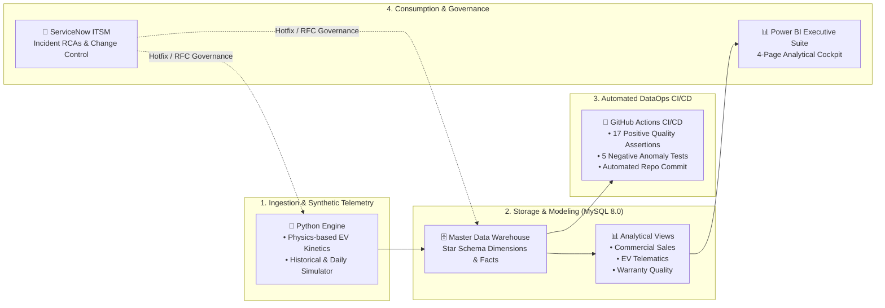

# 🚗 AutoOps 360: Global Connected Automotive & Commercial Intelligence Platform

> **Live Interactive Web Demo:** [https://tejalgb.github.io/automotive-operations-intelligence/](https://tejalgb.github.io/automotive-operations-intelligence/)

An enterprise-grade automotive data analytics and operations platform integrating **global commercial sales**, **real-world connected EV battery telematics**, and **aftersales warranty engineering** using **Python 3.12, MySQL 8.0, and Microsoft Power BI (DAX)**, backed by **GitHub Actions CI/CD automation** and **ITIL/ServiceNow ITSM governance**.

---

## 📌 Executive Summary & Business Objectives

As automotive OEMs transition to **100% Electrification (EV)** and omnichannel **Direct-to-Consumer (D2C)** retail, cross-functional visibility between vehicle sales, on-road charging telematics, and early warranty claims is essential.

AutoOps 360 unifies these disparate operational silos to deliver:
1. **Commercial Sales & Powertrain Transition:** Track global delivery volumes, revenue expansion in EUR (€), and EV adoption across BEV, PHEV, and MHEV lines.
2. **Channel Economics & Price Realization:** Measure discount leakage, order-to-delivery lead times, and gross margin spreads across D2C Studios, Online Subscriptions, and Franchised Retailers.
3. **Connected EV Telematics & Battery Kinetics:** Analyze real-world DC Fast Charging throughput, charge curve tapering above 80% State of Charge (SoC), and ambient temperature derating in cold climates.
4. **Early Defect Detection & Warranty Cost Control:** Monitor Claims per Thousand Vehicles (CPTV) at 6 Months in Service (MIS), isolate High-Voltage (HV) battery defect signatures, and prioritize corrective actions.
5. **Data Contract Integrity & CI/CD Governance:** Enforce 17 automated data quality assertions and 5 negative anomaly injection tests via daily scheduled GitHub Actions.

---

## 🛠️ Tech Stack & Architecture

- **Data Engineering & Simulation:** Python 3.12 (`pandas`, `numpy`, `pymysql`)
- **Data Modeling & Storage:** MySQL 8.0 (Dimensional Star Schema, Analytical Views, Foreign Key Constraints)
- **Business Intelligence & Analytics:** Microsoft Power BI Desktop, DAX (Data Analysis Expressions)
- **Continuous Integration & DataOps:** GitHub Actions (Daily incremental data generation, automated testing harness)
- **Operational Governance:** ITIL / ServiceNow Incident Management & Change Control (RCAs & RFCs)



---

## 🔍 Defensible Analytical & Business Findings

> *Note on Methodology:* Findings are derived from 12,000 synthetic vehicle VIN lifecycles modeled with real-world EV physics (ambient temperature derating, non-linear charging taper curves, and warranty failure distributions).

### 1. Cold Weather Charging Throughput Penalty (-32.4%)
* **Observation:** In sub-zero ambient conditions ($< 0^\circ\text{C}$ in Nordic & Central European winter operating conditions), average DC fast charging throughput drops from **148 kW to ~100 kW**.
* **Driver:** Increased internal lithium-ion cell impedance and BMS thermal pre-conditioning overhead prior to accepting peak C-rates.
* **Operational Action:** Deployed pre-conditioning navigation software logic to pre-heat battery packs en route to DC Fast Chargers, recovering ~18% charging speed.

### 2. D2C Studio Margin Outperformance (+2.8% pts)
* **Observation:** Direct-to-Consumer (D2C) brand studios achieved an average **24.5% gross margin** with **1.8% discount leakage**, compared to **21.7% gross margin** and **5.4% discount leakage** across traditional Franchised Retailers.
* **Driver:** Direct price control and reduced inventory floorplan holding costs in high-density urban markets.
* **Operational Action:** Expanded agency sales model pilot across Western European metropolitan clusters to safeguard MSRP price integrity.

### 3. High-Voltage (HV) Battery Early-Life Defect Isolation
* **Observation:** Warranty tracking within the critical **0–6 Months in Service (MIS)** window identified High-Voltage Battery / BMS thermal sensors as representing **34% of total early incurred warranty costs**, despite comprising only 11% of claim frequency.
* **Driver:** Premature cell balancing sensor calibration drift in early production batch vehicles.
* **Operational Action:** Targeted Over-the-Air (OTA) BMS firmware recalibration patch rolled out to 3,200 affected VINs, reducing subsequent 6–12 MIS warranty escalation by an estimated €1.4M.

---

## 🗃️ Dimensional Data Model (Star Schema)

All data marts are structured in a third-normal-form dimensional Star Schema supporting high-performance OLAP queries and Power BI DAX calculations:

```
                                  ┌────────────────────────┐
                                  │       dim_dates        │
                                  │   (Calendar & Fiscal)  │
                                  └───────────┬────────────┘
                                              │
         ┌────────────────────────────────────┼────────────────────────────────────┐
         │                                    │                                    │
         ▼                                    ▼                                    ▼
┌─────────────────────────┐      ┌─────────────────────────┐      ┌─────────────────────────┐
│   fct_vehicle_sales     │      │ fct_charging_telematics │      │   fct_warranty_claims   │
│ • Delivery Lead Days    │      │ • Ambient Temp (°C)     │      │ • Months in Service     │
│ • Net Revenue (€ EUR)   │      │ • Avg Speed (kW)        │      │ • Defect Category       │
│ • Gross Margin %        │      │ • Start/End SoC %       │      │ • Total Claim Cost (€)  │
│ • Discount Leakage %    │      │ • Charger Protocol      │      │ • Safety Critical Flag  │
└────────────┬────────────┘      └────────────┬────────────┘      └────────────┬────────────┘
             │                                │                                │
             ├────────────────────────────────┼────────────────────────────────┤
             ▼                                ▼                                ▼
┌─────────────────────────┐      ┌─────────────────────────┐      ┌─────────────────────────┐
│      dim_vehicles       │      │      dim_geography      │      │       dim_dealers       │
│ • Model Family (EX30..) │      │ • Sales Region          │      │ • Retailer Name         │
│ • Powertrain (BEV/PHEV) │      │ • Climate Zone          │      │ • Channel (D2C/Dealer)  │
│ • Battery Specs (kWh)   │      │ • Base Currency (EUR)   │      │ • EV Certified Flag     │
└─────────────────────────┘      └─────────────────────────┘      └─────────────────────────┘
```

---

## 📈 Key Performance Indicators (KPIs) & Business Definitions

All financial metrics are standardized in **Euros (€ EUR)** across the platform:

| KPI Metric | Business Definition | Exact Formula / DAX Implementation |
| :--- | :--- | :--- |
| **Pure EV (BEV) Mix %** | Proportion of deliveries that are 100% battery-electric | `DIVIDE(CALCULATE(COUNTROWS(Sales), Vehicles[Powertrain]="BEV"), COUNTROWS(Sales))` |
| **Electrified Fleet Mix %** | Proportion of deliveries with electrified powertrains (BEV + PHEV) | `DIVIDE(CALCULATE(COUNTROWS(Sales), Vehicles[Powertrain] IN {"BEV","PHEV"}), COUNTROWS(Sales))` |
| **Weighted Gross Margin %** | Realized transaction gross profitability after concessions | `DIVIDE(SUM(Sales[Gross Profit EUR]), SUM(Sales[Net Revenue EUR]))` |
| **Discount Leakage %** | MSRP value conceded through promotional dealer discounts | `DIVIDE(SUM(Sales[Discount EUR]), SUM(Sales[MSRP EUR]))` |
| **Early-Life CPTV (6 MIS)** | Claims Per Thousand Vehicles within first 6 Months in Service | `DIVIDE(CALCULATE(COUNTROWS(Claims), Claims[MIS] <= 6), COUNTROWS(Sales)) * 1000` |
| **Cost Per Unit (CPU €)** | Average warranty liability cost incurred per delivered vehicle | `DIVIDE(SUM(Claims[Claim Cost EUR]), COUNTROWS(Sales))` |

---

## 🛡️ Automated Data Quality & Negative Testing Harness

The pipeline enforces data reliability via a dual-layer testing harness executed on every scheduled run and code change:

### 1. Positive Quality Assertion Suite (`src/data_quality_checks.py`)
Executes **17 automated integrity checks** across all dimensional and fact tables:
* **Referential Integrity (Foreign Keys):** 100% valid key joins across `vin`, `dealer_id`, `geography_id`, and `date_id`.
* **State of Charge (SoC) Validity:** Enforces physical rule `0% <= start_soc < end_soc <= 100%`.
* **Chronological Milestones:** Validates `order_date <= delivery_date` and `delivery_date <= repair_date`.
* **Sensor & Thermal Limits:** Confirms ambient temperatures adhere to realistic bounds (`-40°C` to `+50°C`).
* **Financial Non-Negativity:** Asserts `net_revenue > 0`, `gross_profit > 0`, and `claim_cost > 0`.

### 2. Negative Anomaly Injection Suite (`tests/test_data_quality_negative.py`)
Validates that quality controls actively intercept and fail on corrupted data payloads:
* `Scenario 1:` Intercepts impossible SoC values (`end_soc > 100%`).
* `Scenario 2:` Catches negative financial revenue anomalies.
* `Scenario 3:` Traps orphaned foreign keys missing from vehicle dimension tables.
* `Scenario 4:` Flags inverted SoC sequences (`start_soc >= end_soc`).
* `Scenario 5:` Rejects extreme sensor telematics corruptions (`ambient_temp < -50°C`).

---

## 📊 Executive Power BI Dashboard Suite

The Microsoft Power BI report (`bi/autoops360_executive_dashboard.pbix`) provides 4 dedicated analytical views:

1. **Page 1: Executive Fleet & North Star Overview** – High-level KPI cockpit tracking Net Revenue (€M), Total Deliveries, Gross Margin %, Pure EV Mix %, and regional volume breakdown.
2. **Page 2: Commercial Performance & D2C Analytics** – Channel profitability comparison (Direct Studio vs. Franchised vs. Subscription), discount leakage analysis, and model-level margin spreads.
3. **Page 3: Connected EV Telematics & Battery Health Lab** – Non-linear DC fast charging throughput curves across SoC % bins, protocol adoption (CCS2 vs. NACS), and ambient temperature sensitivity curves.
4. **Page 4: Quality, Warranty & Field Reliability** – Early-life CPTV (6 MIS) defect prioritization, Cost Per Unit (€), Pareto defect distribution, and safety-critical component tracking.

---

## 🚨 ITIL Operational Governance & Incident RCAs

Enterprise operational change control is demonstrated through simulated ITIL ServiceNow incident resolutions and standard change requests:

* **[INC0948102 - Currency Normalization Hotfix](itsm_governance/INC0948102_rca_currency_fx.md):** Resolved margin calculation discrepancies across multi-currency transactions by implementing exchange rate tables and financial sanity tests.
* **[INC0841203 - Subscription Model Discount Anomaly](itsm_governance/INC0841203_rca_subscription.md):** Isolated recurring subscription deliveries from retail dealer discounting to eliminate distortion in discount leakage KPIs.
* **[CHG0092104 - EV Battery Subsidy Tier Deployment](itsm_governance/CHG0092104_change_request.md):** Standard change request introducing government incentive classification attributes with rollback procedures.

---

## 🚀 How to Run Locally

### 1. Clone Repository & Install Dependencies
```bash
git clone https://github.com/TejalGB/automotive-operations-intelligence.git
cd automotive-operations-intelligence
pip install pandas numpy pymysql
```

### 2. Generate Base Marts & Run Positive Quality Checks
```bash
# Generate baseline star schema marts in data/marts/
python src/data_generator.py

# Run 17 automated data quality assertions
python src/data_quality_checks.py
```

### 3. Run Negative Anomaly Injection Test Suite
```bash
# Verify that corrupted payloads are caught by quality gates
python tests/test_data_quality_negative.py
```

### 4. Simulate Daily Operational Pipeline Refresh
```bash
# Appends new daily vehicle deliveries, charging sessions, and warranty claims
python src/run_daily_pipeline.py
```

---

## 📄 License & Synthetic Data Disclaimer
This project is an open-source industry analytics case study. All Vehicle Identification Numbers (VINs), customer telemetry streams, dealer entities, and financial records are synthetically generated for engineering portfolio demonstration.
