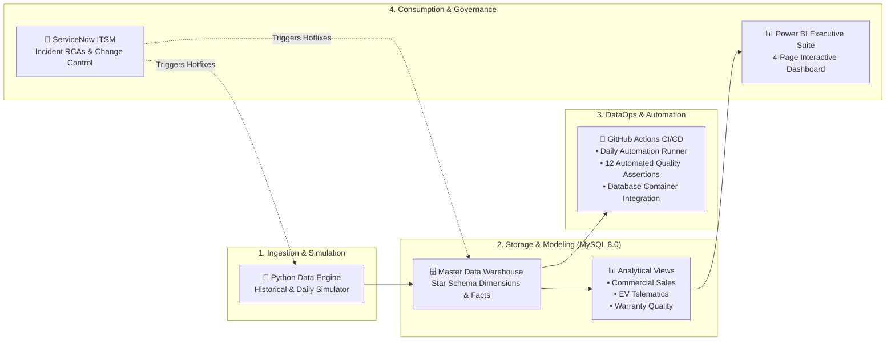
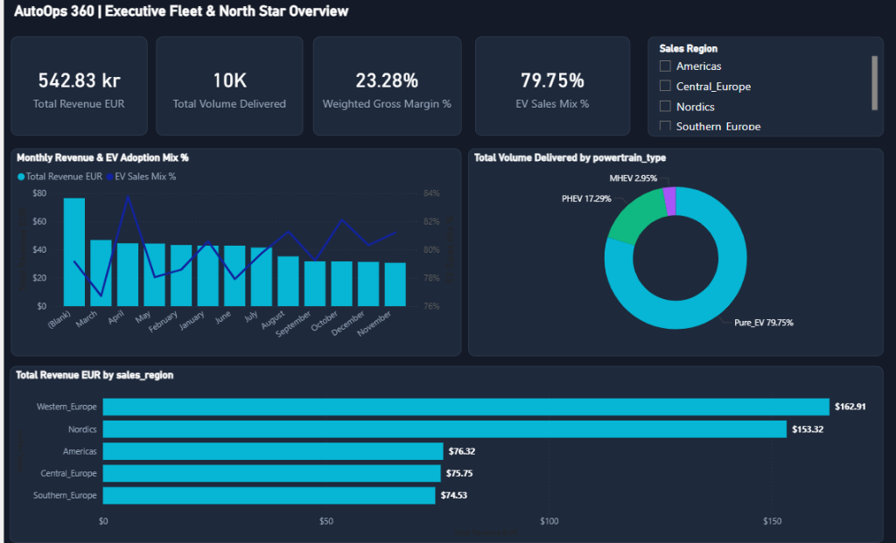
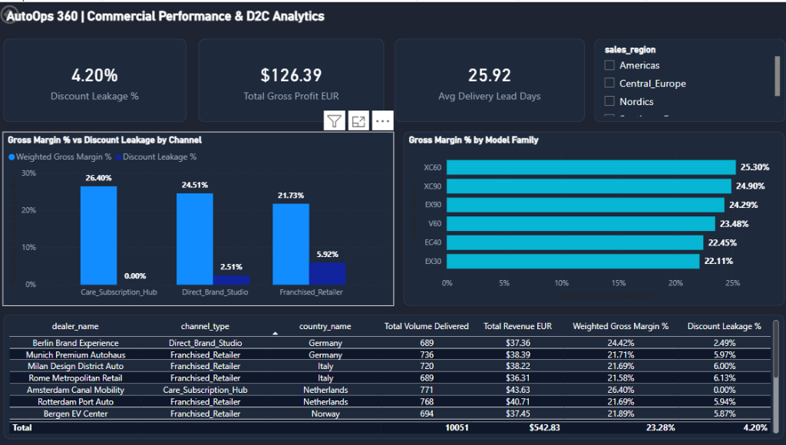
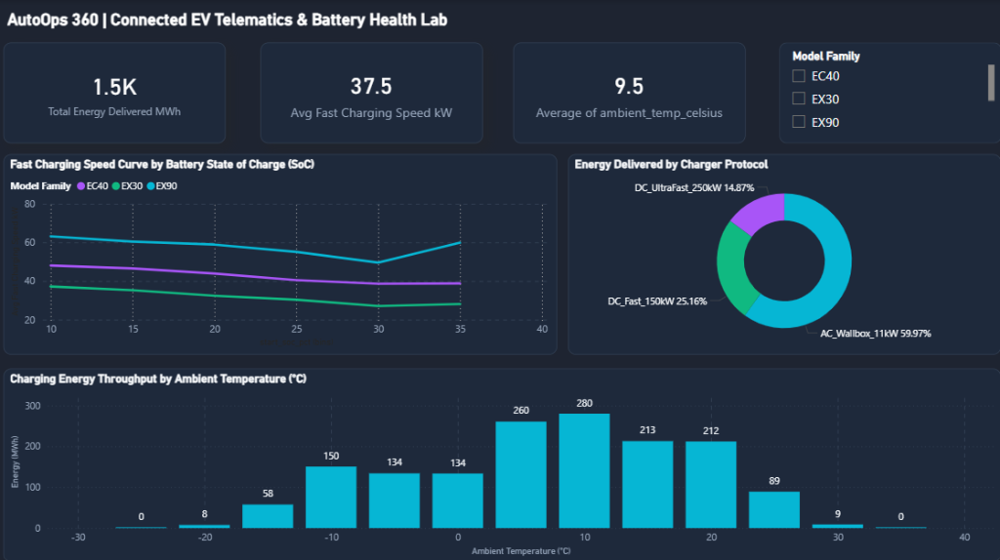
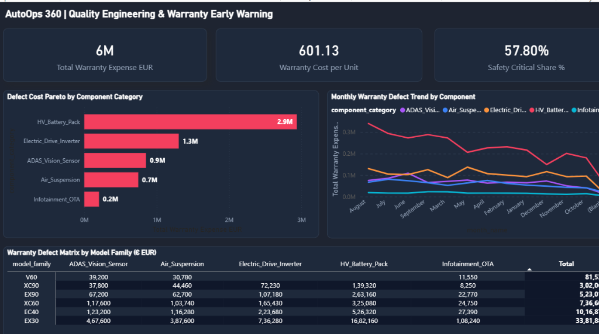

# 🚗 AutoOps 360: Global Connected Automotive & Commercial Intelligence Platform

An enterprise-grade automotive data analytics and operations platform connecting **global commercial sales**, **real-world connected EV battery telematics**, and **aftersales warranty engineering** using **Python, MySQL 8.0, and Microsoft Power BI**, with automated **GitHub Actions CI/CD** and **ServiceNow ITSM governance**.

---

## 📌 Executive Summary & Business Objectives

As global automotive manufacturers accelerate the transition toward **100% Electrification (EV)** and omnichannel **Direct-to-Consumer (D2C)** sales, leadership requires unified, cross-functional intelligence.

This project delivers an end-to-end analytics framework to:
1. **Track Commercial Sales & EV Adoption:** Monitor top-line revenue expansion, powertrain transition mix (BEV/PHEV/MHEV), and gross margin performance across global markets.
2. **Evaluate Channel Economics & Discount Leakage:** Analyze dealer concessions, delivery lead times, and Direct-to-Consumer (D2C) studio margins versus traditional franchised retailers.
3. **Analyze Connected EV Telematics & Battery Kinetics:** Assess real-world DC Fast Charging throughput curves, charging protocol adoption, and ambient temperature/cold weather range degradation.
4. **Early Defect Detection & Warranty Cost Control:** Track Claims per Thousand Vehicles (CPTV) at 6 Months in Service (MIS) and Pareto defect signatures to mitigate recall risks.
5. **Ensure Data Quality & Change Governance:** Enforce 100% data contract integrity through automated CI/CD assertion suites and ServiceNow Incident Root Cause Analyses (RCAs).

---

## 🛠️ Tech Stack & Architecture

- **Data Engineering & Automation:** Python 3.12 (Pandas, NumPy, PyMySQL)
- **Database & Data Modeling:** MySQL 8.0 (Dimensional Star Schema, Analytical CTE Views)
- **Business Intelligence & Reporting:** Microsoft Power BI Desktop, DAX (Data Analysis Expressions)
- **CI/CD & Orchestration:** GitHub Actions (Automated daily data generation, 12 data quality assertions, schema testing)
- **Enterprise IT Governance:** ServiceNow ITSM Incident Management & Change Control (RCAs & CHGs)



---

## 🗃️ Dimensional Data Model (Star Schema)

```
                                  ┌────────────────────────┐
                                  │       dim_dates        │
                                  │   (Calendar & Fiscal)  │
                                  └───────────┬────────────┘
                                              │
         ┌────────────────────────────────────┼────────────────────────────────────┐
         │                                    │                                    │
         ▼                                    ▼                                    ▼
┌─────────────────────────┐      ┌─────────────────────────┐      ┌─────────────────────────┐
│   fct_vehicle_sales     │      │ fct_charging_telematics │      │   fct_warranty_claims   │
│ • Delivery Lead Days    │      │ • Ambient Temp (°C)     │      │ • Months in Service     │
│ • Net Revenue (EUR)     │      │ • Avg Speed (kW)        │      │ • Defect Category       │
│ • Gross Margin %        │      │ • Start/End SoC %       │      │ • Total Claim Cost      │
│ • Discount Leakage %    │      │ • Charger Protocol      │      │ • Safety Critical Flag  │
└────────────┬────────────┘      └────────────┬────────────┘      └────────────┬────────────┘
             │                                │                                │
             ├────────────────────────────────┼────────────────────────────────┤
             ▼                                ▼                                ▼
┌─────────────────────────┐      ┌─────────────────────────┐      ┌─────────────────────────┐
│      dim_vehicles       │      │      dim_geography      │      │       dim_dealers       │
│ • Model Family (EX30..) │      │ • Sales Region          │      │ • Retailer Name         │
│ • Battery Specs (kWh)   │      │ • Climate Zone          │      │ • Channel (D2C/Dealer)  │
│ • Software Release      │      │ • Currency Exchange     │      │ • EV Certified Flag     │
└─────────────────────────┘      └─────────────────────────┘      └─────────────────────────┘
```

---

## 📊 Executive Power BI Dashboard Suite

The interactive Power BI report provides an executive-level cockpit across 4 dedicated views:

### Page 1: Executive Fleet & North Star Overview
High-level KPI tracking of Total Revenue (€M), Delivery Volume, Gross Margin %, EV Sales Mix %, and regional market contribution.



### Page 2: Commercial Performance & D2C Analytics
Discount leakage analysis, channel profitability (D2C Studio vs. Subscription vs. Franchised Retailer), and model-level margins.



### Page 3: Connected EV Telematics & Battery Health Lab
Fast-charging speed curves across State of Charge (SoC %), charger protocol split, and ambient temperature throughput distribution (-30°C to +40°C).



### Page 4: Quality, Warranty & Field Reliability
Early-life defect detection (CPTV at 6 Months in Service), Cost Per Unit (CPU €), Pareto defect prioritization, and component risk matrix.



---

## 📈 Key Performance Indicators (KPIs)

| KPI Metric | Business Definition | Formula / Calculation |
| :--- | :--- | :--- |
| **EV Sales Mix %** | Proportion of total deliveries that are pure electric (BEV) | `COUNT(Pure_EV Deliveries) / COUNT(Total Deliveries)` |
| **Weighted Gross Margin %** | Realized profitability margin across global transactions | `SUM(Gross Profit EUR) / SUM(Net Revenue EUR)` |
| **Discount Leakage %** | MSRP value conceded to dealer discounting | `SUM(Discount Amount EUR) / SUM(MSRP EUR)` |
| **Early Life CPTV** | Claims Per Thousand Vehicles within first 6 Months in Service | `(Claims <= 6 MIS / Total Deliveries) * 1000` |
| **Cost Per Unit (CPU)** | Average warranty liability cost per vehicle delivered | `SUM(Warranty Incurred Expense) / Total Deliveries` |

---

## 🚨 ServiceNow ITSM Incident & Change Governance

This project demonstrates enterprise operational governance through documented production incident resolutions and change requests:

* **[INC0948102 - Currency Normalization Hotfix](itsm_governance/INC0948102_rca_currency_fx.md):** Resolved margin calculation discrepancies across multi-currency transactions (GBP/USD) by implementing exchange rate tables and automated financial sanity tests.
* **[INC0841203 - Subscription Model Discount Anomaly](itsm_governance/INC0841203_rca_subscription.md):** Isolated recurring subscription deliveries from retail dealer discounting to eliminate distortion in discount leakage KPIs.
* **[CHG0092104 - EV Battery Subsidy Tier Deployment](itsm_governance/CHG0092104_change_request.md):** Standard change request introducing government incentive classification attributes with verified rollback procedures.

---

## 🚀 How to Run & Refresh Locally

### 1. Clone the Repository
```bash
git clone https://github.com/TejalGB/automotive-operations-intelligence.git
cd automotive-operations-intelligence
```

### 2. Install Python Dependencies
```bash
pip install pandas numpy pymysql
```

### 3. Generate Historical Data & Run Quality Checks
```bash
# Generate baseline star schema datasets
python src/data_generator.py

# Run 12 automated data quality assertions
python src/data_quality_checks.py
```

### 4. Simulate Daily Pipeline Refresh
```bash
# Appends new daily vehicle sales, telematics, and warranty claims
python src/run_daily_pipeline.py
```

### 5. Refresh Power BI Dashboard
1. Open your Power BI report (`.pbix`) in Power BI Desktop.
2. Click **Refresh** on the **Home** ribbon to load the latest pipeline records.

---

## 📄 License & Attribution
This project is an industry case study designed for portfolio demonstration. All vehicle identification numbers (VINs), dealer names, and telemetry records are synthetically generated.
