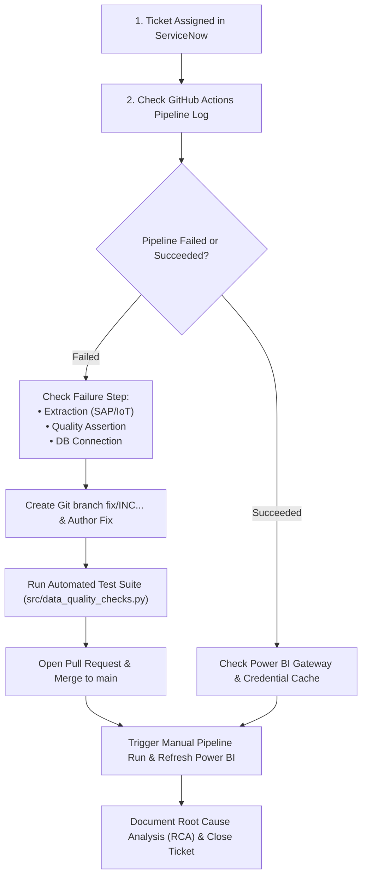

# 📖 Standard Operating Procedure (SOP): Data Operations & Incident Triage

| Document ID | SOP-DATA-004 |
| :--- | :--- |
| **Title** | Data Pipeline Failure & Power BI Refresh Incident Triage |
| **Owner** | Lead Data Analytics Engineer |
| **Applicability** | Global Commercial & Connected Vehicle Operations Analytics |
| **Review Frequency** | Bi-Annually |

---

## 1. Purpose
This Standard Operating Procedure defines the step-by-step triage protocol when a production data pipeline failure, automated data quality alert, or Power BI dataset refresh error is logged via ServiceNow.

---

## 2. Severity Classification Matrix

| Priority | Business Condition | Response SLA | Resolution SLA |
| :--- | :--- | :--- | :--- |
| **P1 - Critical** | Executive Board / C-Suite dashboard offline or global data corruption | 15 Minutes | 2 Hours |
| **P2 - High** | Departmental dashboard refresh failed (Commercial Sales / Warranty) | 30 Minutes | 4 Hours |
| **P3 - Medium** | Non-critical calculation anomaly, individual visual rendering issue | 2 Hours | 1 Business Day |
| **P4 - Low** | User access request, cosmetic enhancement, export request | 4 Hours | 3 Business Days |

---

## 3. Step-by-Step Triage Procedure



### Phase 1: Identification & Acknowledgment
1. Acknowledge the ServiceNow ticket within SLA window and assign ticket to self.
2. Check GitHub Actions workflow tab (`.github/workflows/daily_pipeline.yml`) to verify the last execution status.

### Phase 2: Diagnostic & Isolation
1. **If GitHub Actions failed:** Inspect the specific failing test in `src/data_quality_checks.py`.
2. **If MySQL DB is unreachable:** Verify MySQL service status and port 3306 availability.
3. **If Power BI Gateway timed out:** Verify gateway cluster connectivity and data source credentials.

### Phase 3: Hotfix & Verification
1. Create a hotfix Git branch using ticket ID: `git checkout -b fix/INCXXXXXXX-short-description`.
2. Apply SQL / Python / DAX fix locally.
3. Execute the quality assertion suite:
   ```bash
   python src/data_quality_checks.py
   ```
4. Push branch and create a Pull Request. Verify green CI check in GitHub Actions.

### Phase 4: Resolution & Post-Mortem
1. Merge PR to `main` branch.
2. Manually trigger workflow dispatch to refresh data marts.
3. Refresh Power BI Service dataset.
4. Complete the **Root Cause Analysis (RCA)** template in `itsm_governance/` and attach to the ServiceNow ticket before marking as **Resolved**.
